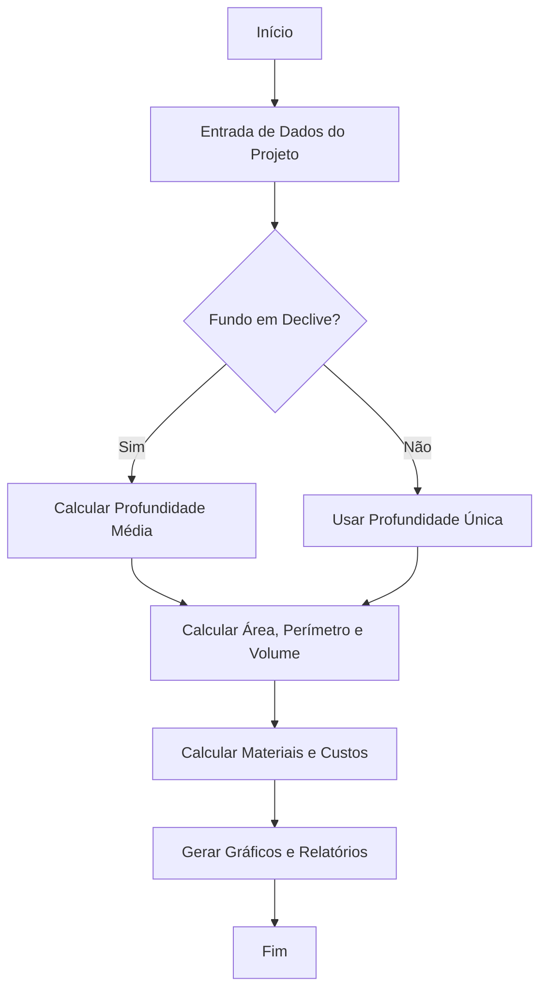

# 💧 Orçamento Rápido – Calculadora de Piscinas

## 📘 Sobre o Projeto
O **Orçamento Rápido – Calculadora de Piscinas** é uma ferramenta desenvolvida em **Python** com o objetivo de **automatizar o processo de orçamento de piscinas residenciais**, tornando-o mais rápido, prático e acessível para engenheiros, arquitetos e construtoras.

O projeto surgiu da observação prática dos integrantes **Maria Luiza Mendes Andeasi**, **Rafaela Porto** e **Guilherme Silva**, que acompanham obras e identificaram a necessidade de uma solução que reduzisse o tempo e os erros em orçamentos manuais — comuns em projetos desse tipo.

Com isso, o grupo desenvolveu uma ferramenta capaz de gerar **relatórios técnicos completos** (em **PDF** e **Excel**), com **gráficos de custos, consumo de materiais e etapas construtivas**, proporcionando **transparência e eficiência** no planejamento de obras.

---

## 🎯 Objetivo
Automatizar o orçamento de materiais e custos para a construção de piscinas com base em:
- Dimensões fornecidas (largura, comprimento e profundidade);
- Opções construtivas (revestimento, fundo plano ou em declive, hidromassagem);
- Preços unitários pré-definidos;
- Geração automática de relatórios profissionais (**PDF** e **Excel**).

---

## 🧠 Funcionalidades Principais

### 🔹 1. Cálculo de Materiais
- Estima blocos, cimento, areia, impermeabilizante, argamassa, rejunte, espaçadores, revestimento e outros insumos.
- Usa coeficientes técnicos com base na área da piscina e profundidade média.

### 🔹 2. Cálculo de Custos
- Gera custos por material e por fase construtiva (alvenaria, impermeabilização, revestimento etc.).
- Calcula custo de enchimento (em m³) e tempo estimado com base na vazão.

### 🔹 3. Geração de Relatórios
- **Planilha Excel (.xlsx)** com abas de materiais, custos e dados do projeto;
- **Relatório PDF profissional**, incluindo:
  - Tabelas organizadas;
  - Gráficos de barras e pizza;
  - Descrição técnica das etapas construtivas.

### 🔹 4. Visualização Gráfica
- Gráficos de **barras horizontais** e **linha** para consumo de materiais e custos por etapa.

---

## 🧩 Estrutura e Tecnologias

### 🐍 Linguagem
- **Python 3**

### 📚 Bibliotecas Utilizadas
| Biblioteca | Função Principal |
|-------------|------------------|
| `math` | Cálculos matemáticos e arredondamentos |
| `os` | Criação e gerenciamento de pastas e arquivos |
| `pandas` | Organização de dados e geração de planilhas Excel |
| `matplotlib` | Geração de gráficos visuais |
| `reportlab` | Criação de relatórios PDF profissionais |
| `typing` | Tipagem de dados para clareza e manutenção do código |

---

## 🧮 Estrutura do Código

1. **Coleta de Dados**
   - Informações do cliente/projeto (nome, dimensões, tipo de piscina etc.).
   - Tratamento de vírgula para entradas decimais.

2. **Cálculos de Área, Volume e Materiais**
   - Considera fundo plano ou em declive.
   - Calcula área total, perímetro e volume.

3. **Cálculo de Custos Totais**
   - Agrupa custos por tipo de material e fase da obra.

4. **Geração de Relatórios e Gráficos**
   - Exporta resultados em **Excel** e **PDF**.
   - Inclui gráficos de custo e consumo de materiais.

---

## 🧠 Estrutura do Fluxo

---

## 👥 Equipe de Desenvolvimento

| Nome | RA | Função |
|------|----|--------|
| **Guilherme Lucas da Silva** | 2405785 | Lógica de programação e apresentação de slides |
| **Maria Luiza Mendes Andreasi** | 2505416 | Desenvolvimento do código, pesquisa e elaboração do relatório técnico |
| **Rafaela Nascimento de Souza Carvalho Porto** | 2406550 | Redação do relatório e aplicação prática do projeto |

---

## 📍 Instituição
**Centro Universitário Padre Anchieta**  
Curso: **Engenharia Civil**  
Cidade: **Jundiaí – SP**  
Ano: **2025**

---

## 🧾 Referências

SODRÉ, Rafael. *Tipos de Piscinas: qual o melhor modelo para sua casa?* Viva Decora, 2024.  
Disponível em: [https://www.vivadecora.com.br](https://www.vivadecora.com.br).  
Acesso em: 9 nov. 2025.

---

## 🗂️ Repositório
O código-fonte completo e os arquivos de saída (planilhas e PDFs gerados) estão disponíveis neste repositório.

> 💡 Este projeto foi desenvolvido com base em aulas práticas de **lógica de programação e engenharia aplicada**, reforçando a importância da tecnologia como aliada na **otimização de processos construtivos**.
